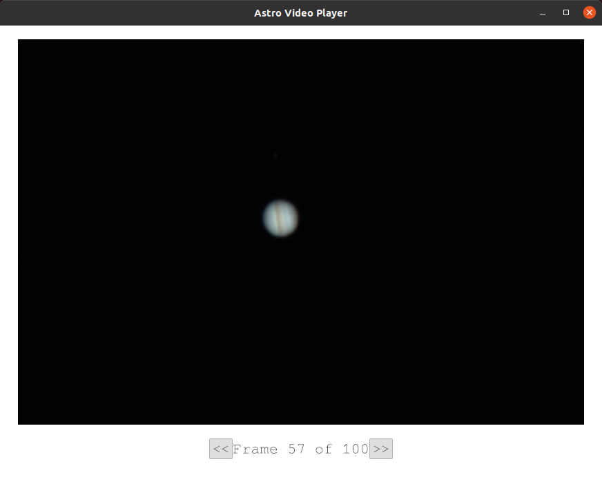

# Astro Video Player

Rust-based video player for astrophotography videos in SER and AVI format. Supports debayering of RAW color images.

Status:

- [X] Works well with one SER file (RAW16, RGGB) from ZWO ASI 294 MC
- [X] Works well with one AVI file (GBR) from ZWO ASI 224 MC
- [ ] Support RAW8
- [ ] Support other bayer color encodings
- [ ] Support mono images
- [ ] Implement better debayering algorithm
- [ ] Allow thumbs up/down on images, export good images to new file (or just allow frames to be dropped)
- [ ] Support AVI <--> SER conversion
- [ ] Allow individual frames to be exported
